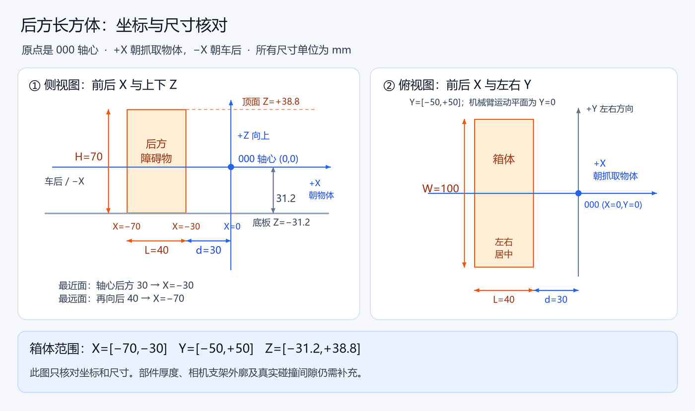

# v4.4：后方箱体与微调路径检查

本文保留 v4.4 模型记录。当前 v4.5 修改三个参考动作，使其不发送 003；抓人质参考因机械结构改变待重录，届时应重新计算范围。当前交付见 [v4.5 说明](ARM_FIXED_ACTION_V4_5.md)，本报告原哈希/测试记录不代表当前镜像。

2026-10-02。图中箱体位置和尺寸已由用户确认。固件加入独立 `arm_collision.h/.c`，微调参考同步、范围扫描、完整轨迹和松开减速路径均使用该检查。沿用按住 wt、松开减速和现有蓝牙字段。

## 采用的模型

以 000 轴心为原点，+X 朝抓取物体、+Z 向上；运动平面为 Y=0。

| 项目 | 数值 mm | 来源 |
|---|---|---|
| 后方箱体 X | −70～−30 | 最近面后方30，向后深40，已确认 |
| 后方箱体 Y | −50～+50 | 总宽100，按左右居中建模 |
| 后方箱体 Z | −31.2～+38.8 | 000高于底板31.2，箱高70，已确认 |
| 000→001 包络半径 | 15 | 初步估计 |
| 001→002 包络半径 | 20 | 初步估计 |
| 002→虚拟抓点包络半径 | 60 | 相机/夹爪组件的初步估计 |
| 额外间隙 | 5 | 可调初值 |



用户估计机械臂厚度约24 mm，但尚未区分侧面外廓和左右宽度，不能把它视为各部件的完整实测尺寸。暂使用15/20 mm半径留余量；工具组件60 mm半径也尚未验证覆盖相机、支架和张开夹爪。状态显示 `ENVELOPE_ESTIMATED=1`。这里的“包络”就是绕轴心连线包一层有厚度的空间；真实零件必须完全装在这层空间内，模型检查才有效。

参数集中在 `Core/Inc/arm_collision_config.h`，以后可直接改尺寸和间隙后构建。未做整机CAD；模型不包含自碰撞、桶口、目标物或其他车体部件。31.2是轴心相对底板高度，原 `ARM_BASE_AXIS_HEIGHT_MM=120` 地面参考未因此改变。L2保持(82+87.5)/2=84.75 mm。

## 当前边界

关节限位：000=915～1800、001=947～2500、002=500～1874。三个测试参考动作与夹紧500/松开1800不变。

| 参考 | 仅运动学模型范围 mm | 加后方箱体及估计包络后 mm |
|---|---|---|
| BALL | −75～+4 | −75～+4 |
| HOSTAGE | −35～+56 | −11～+56 |
| BUCKET | −71～+14 | −42～+14 |

相对初始参考，负=靠近车，正=远离车，1 mm扫描，搜索±75 mm；BALL −75仍是搜索边界。区间基于当前几何、标定、包络和插补假设，**不是已完成实物验收的无碰撞范围**。`MODEL_MM`、`ENABLED_MM`现在包含启用的箱体约束；仍整次拒绝超范围请求，不截断到边界。按住运动正常规划到边界并减速结束。

旧抓人质抬起 `HOSTAGE_LIFT/TH_U`（1800/1855/528/500）通过关节限位，但本包络模型判定静态姿态及HOSTAGE→LIFT插补路径有干涉；零厚度轴心连线距箱体最近约11.6 mm，小于第一段15 mm半径加5 mm间隙。**旧固定动作的P值和执行入口未因此改写或禁止；恢复P1800仅恢复关节限位可请求性。此次箱体保护接在独立微调模块，不能代替固定动作就位、抬起或外部动作组的路径验证。** 给定可靠起止P值后可用纯计算接口检查固定路径；目前首次就位的真实起点没有反馈，不能假设已知。

## 路径检查方法及接口

三段实体暂表示为胶囊：轴心连线或工具向量，加各自半径。计算胶囊到长方体的距离，另留配置间隙。`ArmCollision_CheckPose`检查单姿态，`ArmCollision_CheckEdge`检查线性关节插补。中间采样之外，还按杆长及关节角变化推导位移上界，加到间隙上，避免漏掉采样点之间扫过箱体。默认附加采样位移上界≤0.5 mm；极端或无效输入拒绝。

这是模型中的连续路径约束，真实舵机同步性、背隙、变形和控制板插补仍需要台架验证。没有实际关节、力或碰撞传感器反馈，软件不能检测真实碰撞。

可迁移接口在 `arm_collision.h`，无HAL、蓝牙、分配或串口发送。`ArmTrim_DefaultConfig`默认关闭碰撞模型，迁移时由调用者填写；本项目适配器调用 `ArmCollision_ProjectModel`启用上述箱体。迁移构建还需加入 `arm_collision.c`。

`STATUS`新增一行：

```text
TRIM REAR_BOX_GUARD=1 ENVELOPE_ESTIMATED=1 CLEARANCE_MM=5
```

结果4表示超出启用区间或关节限位，结果5表示路径模型失败，包含箱体检查失败；不是实物碰撞反馈。BEGIN失败不发送运动、不建立参考。

## 如何测试

保持现有手机页面。停车、选固定参考动作并等待稳定，先用文本 `@ARM TRIM DX 1` / `DX -1` 各小步检查高度、方向及最近间隙，再逐步验证按住 wt。不要用碰撞找限位。实测记录填 `ARM_TRIM_ACCEPTANCE.md`；固定动作就位和抬起路径单独核对。

以下只在PC计算模型，不连接板子，gcc需在PATH：

```powershell
powershell -ExecutionPolicy Bypass -File "D:\工科大\e-control-trim-test-20261001\scripts\inspect_rear_box.ps1"
```

软件检查通过：碰撞40项、微调48676项、蓝牙28780项。覆盖厚度/间隙、左右错开、起终点无碰撞但中途扫过、细障碍、无效模型拒绝、危险参考无发送、边界约束与蓝牙按住到边界。完整固件构建通过：text82204 B、data108 B、bss24724 B。之前v4.3机械臂246项、正逆解61项已通过，其代码未在本轮改变。PC模型检查发送次数为0。

本轮未烧录或驱动硬件。新固件在 `firmware_direct`，SHA256见 `FIRMWARE_SHA256.txt`。启动标识 `ARM TRIM FW=V4.4 L2_MM=84.75 WT=HOLD_JOG BYTE0=0_OR_84`。烧录/校验步骤见 `ARM_JOG_V4_TEST.md`。更新前v4.3固件与配置保存在 `rollback_v4_3_20261002`，旧ZIP也保留；读取旧固件诊断需选匹配的目录和ELF。
